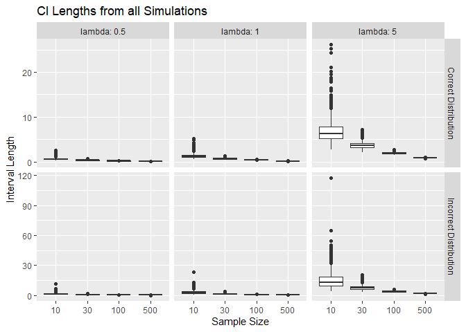
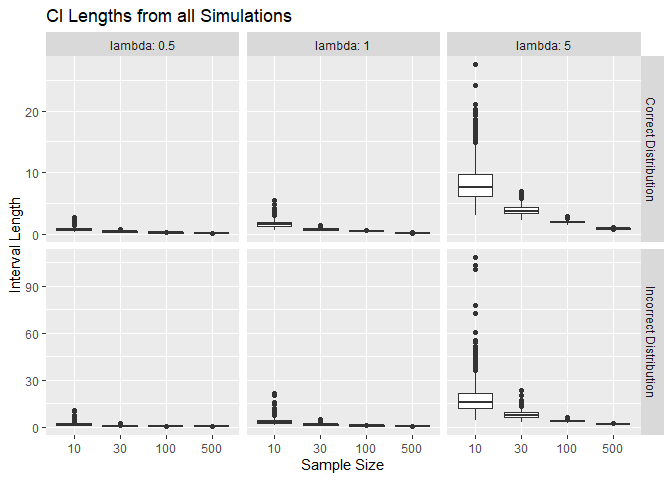
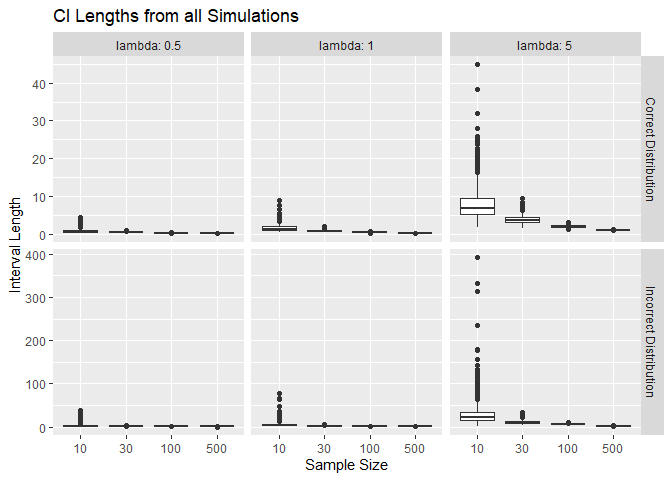
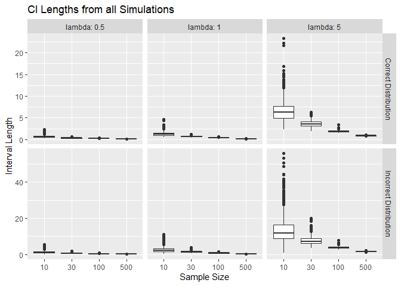
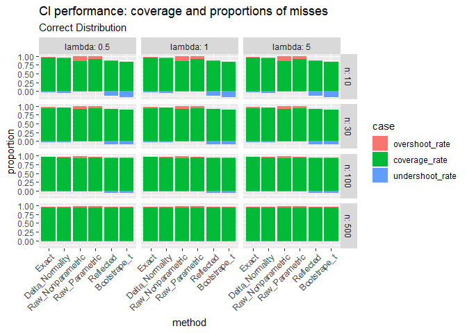
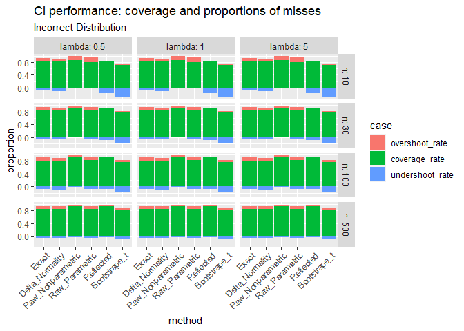
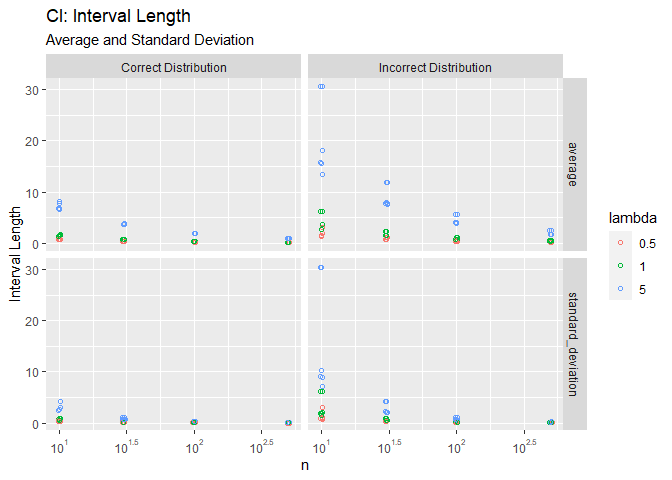
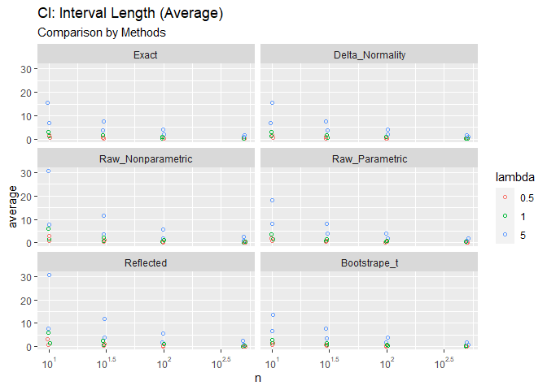

Monte Carlo Simulation Study for Estimators and CI Performance
================
Chien-Lan Hsueh
2023-11-09

- [Project Goal](#project-goal)
- [Set up](#set-up)
  - [Packages](#packages)
  - [Helper Functions](#helper-functions)
  - [Setup (Global Variables)](#setup-global-variables)
- [CIs](#cis)
  - [Method 1: Exact Interval](#method-1-exact-interval)
  - [Method 2: Large-sample Normality Based
    Interval](#method-2-large-sample-normality-based-interval)
  - [Method 3: Raw Percentile Non-parametric Bootstrap
    Interval](#method-3-raw-percentile-non-parametric-bootstrap-interval)
  - [Method 4: Raw Percentile Parametric Bootstrap
    Interval](#method-4-raw-percentile-parametric-bootstrap-interval)
  - [Method 5: Reflected Percentile Parametric Bootstrap
    Interval](#method-5-reflected-percentile-parametric-bootstrap-interval)
  - [Method 6 Bootstrapt Interval](#method-6-bootstrapt-interval)
- [Comparison Summary](#comparison-summary)

## Project Goal

Compare confidence intervals (CI) of an estimator $1/E(\lambda)=\lambda$
obtained from differed methods.

## Set up

### Packages

We will use the following packages in this project:

- `here`: enables easy file referencing and builds file paths in a
  OS-independent way
- `stats`: loads this before loading `tidyverse` to avoid masking some
  `tidyverse` functions
- `tidyverse`: includes collections of useful packages like `dplyr`
  (data manipulation), `tidyr` (tidying data), `ggplots` (creating
  graphs), etc.
- `scales`: formats and labels scales nicely for better visualization

In addition, the `pacman` package provides handy tools to manage R
packages (install, update, load and unload). We use its `p_laod()`
instead of `libarary()` to load the packages listed above.

``` r
if (!require("pacman")) utils::install.packages("pacman", dependencies = TRUE)
```

    ## Loading required package: pacman

``` r
pacman::p_load(
    here,
    stats,
    tidyverse,
    scales
)
```

### Helper Functions

We define the following helper functions:

``` r
# helper function to generate random samples
rs <- function(n = 1, rate = 1, correct_dist = T){
  # generate random numbers from the correct or the incorrect distributions
  if(correct_dist){
    # correct: exponential distribution
    x <- rexp(n, rate = rate)
  } else {
    # incorrect: gamma distribution with wrong mean
    x <- rgamma(n, shape = 0.5, rate = rate)
  }
  
  return(x)
}


# helper function to get CIs
get_CIs <- function(n, lambda, correct_dist, fun_CI){
  # make this analysis reproducible
  set.seed(seed)
  
  # target to capture
  ## for correct dist, check if lambda is captured
  ## for incorrect dist, check if lambda/0.5 is captured
  target <- ifelse(correct_dist, lambda, lambda / 0.5)
  
  # simulate for CI - N times
  df <- tibble(id = 1: N) %>% 
    rowwise() %>% 
    mutate(
      CI = list(fun_CI(n, lambda, correct_dist))
    ) %>% 
    unnest_wider(CI) %>% 
    mutate(
      target = target,
      # properties of CI
      captured = (target >= LB) & (target <= UB),
      miss_by_being_high = LB > target,
      miss_by_being_low = UB < target,
      length = UB - LB
    )
  
  # return CIs and performance measures
  return(pack_results(df))
}


# helper function to pack CI data frame and performance measures
pack_results <- function(df){
  list(
    # CIs from N simulations
    df_CIs = df, 
    # performance
    coverage_rate = mean(df$captured),
    undershoot_rate = mean(df$miss_by_being_low),
    overshoot_rate = mean(df$miss_by_being_high),
    avg_length = mean(df$length),
    sd_avg_length = sd(df$length)
  )
}


# helper function to create box plots of CI lengths
plot_CIs <- function(df){
  df %>% 
  mutate(
    correct_dist = if_else(correct_dist, "Correct Distribution", "Incorrect Distribution")
  ) %>% 
  unnest_longer(df_CIs) %>%  
  ggplot(aes(as_factor(n), df_CIs$length)) +
  geom_boxplot() +
  facet_grid(
    rows = vars(correct_dist),
    cols = vars(lambda),
    labeller = labeller(lambda = label_both),
    scales = "free_y"
  ) +
  labs(
    title = "CI Lengths from all Simulations",
    x = "Sample Size",
    y = "Interval Length"
  )
}
```

#### `rs()`: helper function to generate random samples

To make the code clear, we wrap the two random number generating
functions from the “correct” exponential distribution and the
“incorrect” gamma distribution (with a doubled mean) into this helper
function.

`rs(n = 1, rate = 1, dist = T)`:

> Arguments: - `n`: number of random observations to generate - `rate`:
> rate parameter ($\lambda$) used in `rexp(n, rate)` and
> `rgamma(n, rate, shape = rate)` - `dist`: logical; if `TRUE`, use
> `rexp()`
>
> Return Value: (vector) random samples of length $n$

#### `get_CIs()`: helper function to get confidence intervals from $N$ simulations

This helper function calls one of the core helper function that
calculate confidence interval. For each obtained interval, it checks if
the interval captures the target or miss it (undershoot or overshoot).
This simulation will be repeated for $N$ times and it calls the helper
function `pack_results()` to pack the result for return.

`get_CIs(n, lambda, correct_dist, fun_CI)`:

> Arguments: - `n`: sample size - `lambda`: rate parameter used in
> `rexp(n, rate)` and `rgamma(n, rate, shape = rate)` - `correct_dist`:
> logical; if `TRUE`, use `rexp()` - `fun_CI`: one of the core herlper
> functions to get CI
>
> Return Value: (list) a data frame of $N$ confidence intervals and the
> performance measures

#### `pack_results()`: helper function to pack CI data frame and performance measures

This helper function takes the simulated CIs (data frame) to calculate
the intervals’ performance measures including target coverage
(capturing) rate, missing proportion (undershoot/overshoot) as well as
the average of standard error of the length of intervals.

`pack_results(df)`:

> Arguments: - `df`: a data fram contains $N$ confidence intervals from
> the simulations. The required columns include `CI`, `captured`,
> `miss_by_being_low`, `miss_by_being_high` and `length`.
>
> Return Value: (list) of a data frame of $N$ confidence intervals and
> the performance measures

#### `CI_*()` core helper functions to calculate CI using different methods

There are six methods used in this project to calculate CIs for the
estimator $\hat{\Lambda}$:

- `CI_exac()`: the exact interval
- `CI_delta()`: the large-sample normality based interval using the CLT
  and the Delta method
- `CI_raw_np()`: the raw percentile non-parametric bootstrap interval
- `CI_raw_par()`: the raw percentile parametric bootstrap interval
- `CI_reflected()`: the reflected percentile non-parametric bootstrap
  interval
- `CI_bootstrap_t()`: the bootstrap t-interval using a non-parametric
  bootstrap

Each of them take the same set of arguments and return CI in the same
format.

`CI_*(n, lambda, correct_dist)`:

> Arguments: - `n`: sample size - `lambda`: rate parameter used in
> `rexp(n, rate)` and `rgamma(n, rate, shape = rate)` - `correct_dist`:
> logical; if `TRUE`, use `rexp()`
>
> Return Value: (named list) of one CI with `LB` and `UB` as lower and
> upper bounds.

To make it easier to read, in this report, we put the definitions of
these core helper function in the session of each CI method.

#### `plot_CIs()` helper function to create box plots of CI lengths

Take the CIs saved in the list column `df_CIs` and create box plots of
the CI lengths from all simulations.

`plot_CIs(df)`:

> Arguments: - `df`: a datframe with a list column named `df_CIs` that
> store a data frame of CIs from simulations.

### Setup (Global Variables)

The sample sizes of interest in this project are $n=\{10,30,100,500\}$
from an exponential distribution $Gamma(\lambda)$ with
$\lambda=\{0.5,1,5\}$. We also want to do a comparison to see how robust
the obtained CIs are when we have data that actually not from
exponential distributions.

In this project, we use 95% confidence level for all CIs. A data frame
is also initiated to save these CIs:

``` r
# make this analysis reproducible
seed = 2022

# number of simulation for each method
N <- 1000

# number of primary bootstrapping samples
B <- 500

# number of 2nd bootstrapping samples
## (not used. commented out the secondary bootstrap part)
B2 <- B/2

# methods
methods = c("Exact", "Delta_Normality", "Raw_Nonparametric", "Raw_Parametric", "Reflected", "Bootstrape_t")

# sample sizes
sample_sizes <- c(10, 30, 100, 500)

# lambda
rates <- c(0.5, 1, 5)

# confidence level
CL <-  0.95

# significant level and the values of alpha/2
alpha <-  1 - CL

# alpha/2 and 1-alpha/2
p1 <- (alpha/2)
p2 <- (1 - p1)

# Set up a data frame to save parameters for each CI methods
df_methods <- 
  expand_grid(
    # six methods
    method = methods,
    # correct vs. incorrect distribution
    correct_dist = c(T, F),
    # different lambda values
    lambda = rates,
    # different sample size
    n = sample_sizes
  ) %>% 
  mutate(rowID = row_number()) %>% 
  relocate(rowID)
```

## CIs

### Method 1: Exact Interval

Consider the estimator $\hat{\Lambda}=\frac{1}{\bar{Y}}$ and note
that: - $exp(\lambda) \sim Gamma(1,\lambda)$ -
$c\, Gamma(1,\lambda) \sim Gamma(1, \lambda/c)$ -
$\sum Gamma(1,\lambda) \sim Gamma(n,\lambda)$

$$
\begin{aligned}
\frac{1}{\hat{\Lambda}}&=\bar{Y}=\frac{1}{n}\sum_{i=1}^n Y_i \sim Gamma(n,n\lambda) \\
\frac{\lambda}{\hat{\Lambda}} &=\lambda\bar{Y} \sim Gamma(n,n) \\
P(&\gamma_{1-\alpha/2} \le \frac{\lambda}{\hat{\Lambda}} \le \gamma_{\alpha/2})
= 1-\alpha \\
\Rightarrow\, \text{CI} &= \left( 
\gamma_{1-\alpha/2}\Lambda, \gamma_{\alpha/2}\Lambda 
\right) 
\end{aligned}
$$

- Step 1: generate a sample of size `n` from the specified distribution
  (`correct_dist`) with parameter `lambda`
- Step 2: compute the estimated parameter $\hat{\lambda}$
- Step 3: find the upper and lower bound of the CI from product derived
  above
- Step 4: repeat step 1 to 4 for `N` simulations

``` r
# CI method - exact interval
CI_exact <- function(n, lambda, correct_dist){
  # simulate data
  data <- rs(n, lambda, correct_dist)
  
  # observation estimate
  Lambda = 1 / mean(data)
  
  LB <- qgamma(p1, shape = n, rate = n) * Lambda
  UB <- qgamma(p2, shape = n, rate = n) * Lambda
  
  CI <- list(LB = LB, UB = UB)
  return(CI)
}

# exact CI
proc_timer <- proc.time()

df_exact <- df_methods %>% 
  filter(method == "Exact") %>% 
  rowwise() %>% 
  mutate(CIs = list(get_CIs(n, lambda, correct_dist, CI_exact))) %>% 
  unnest_wider(CIs) %>% 
  # move df_CIs to the last 
  select(-df_CIs, df_CIs) %>% 
  print()
```

    ## # A tibble: 24 × 11
    ##    rowID method correct_dist lambda     n coverage_rate undershoot_rate
    ##    <int> <chr>  <lgl>         <dbl> <dbl>         <dbl>           <dbl>
    ##  1     1 Exact  TRUE            0.5    10         0.95            0.024
    ##  2     2 Exact  TRUE            0.5    30         0.939           0.031
    ##  3     3 Exact  TRUE            0.5   100         0.957           0.025
    ##  4     4 Exact  TRUE            0.5   500         0.945           0.028
    ##  5     5 Exact  TRUE            1      10         0.95            0.024
    ##  6     6 Exact  TRUE            1      30         0.939           0.031
    ##  7     7 Exact  TRUE            1     100         0.957           0.025
    ##  8     8 Exact  TRUE            1     500         0.945           0.028
    ##  9     9 Exact  TRUE            5      10         0.95            0.024
    ## 10    10 Exact  TRUE            5      30         0.939           0.031
    ## # ℹ 14 more rows
    ## # ℹ 4 more variables: overshoot_rate <dbl>, avg_length <dbl>,
    ## #   sd_avg_length <dbl>, df_CIs <list>

``` r
print(proc.time() - proc_timer)
```

    ##    user  system elapsed 
    ##    1.47    0.05    1.55

``` r
# distribution of interval lengths from all simulations
plot_CIs(df_exact)
```

<!-- -->

``` r
# save results
saveRDS(df_exact, here("all_results", "df_exact.rds"))
```

### Method 2: Large-sample Normality Based Interval

Recall $\delta$ Method with $Y=g(X)$:

- $E[Y] \approx g(\mu_X)$
- $\sigma_Y^2 \approx \left.[g'(\mu_X)\right]^2\sigma_X^2$

If $X \overset{\bullet}{\sim} N(\mu, \sigma^2)$ and there exist a
transformation function $g$ and value $\mu$ and $g'(\mu)\ne0$, then

$$
\begin{aligned}
Y = g(X) &\overset{\bullet}{\sim}N\Big(g(\mu), \left.[g'(\mu)\right]^2\sigma^2\Big)
\end{aligned}
$$

For our estimator $\hat{\Lambda} = \frac{1}{\bar{Y}}$,
$E[Y_i]=1/\lambda$ and $Var(Y_i)=1/\lambda^2$, we can use this to
approximate its distribution:

$$
\begin{aligned}
\hat{\Lambda} = g(\bar{Y})=\frac{1}{\bar{Y}} 
&\overset{\bullet}{\sim} N\Big(\lambda, \frac{\lambda^2}{n}\Big)
\end{aligned}
$$

- Step 1: generate a sample of size `n` from the specified distribution
  (`correct_dist`) with parameter `lambda`
- Step 2: compute the estimated parameter $\hat{\lambda}$
- Step 3: find the upper and lower bound of the CI from approximated
  normal distribution shown above
- Step 4: repeat step 1 to 4 for `N` simulations

``` r
# CI method - delta normality interval
CI_delta <- function(n, lambda, correct_dist){
  # simulate data
  data <- rs(n, lambda, correct_dist)
  
  # observation estimate
  Lambda = 1 / mean(data)
  
  LB <- qnorm(p1, Lambda, Lambda/sqrt(n)) 
  UB <- qnorm(p2, Lambda, Lambda/sqrt(n))
  
  CI <- list(LB = LB, UB = UB)
  return(CI)
}


# large-sample delta normality CI
proc_timer <- proc.time()

df_delta <- df_methods %>% 
  filter(method == "Delta_Normality") %>% 
  rowwise() %>% 
  mutate(CIs = list(get_CIs(n, lambda, correct_dist, CI_delta))) %>% 
  unnest_wider(CIs) %>% 
  # move df_CIs to the last 
  select(-df_CIs, df_CIs) %>% 
  print()
```

    ## # A tibble: 24 × 11
    ##    rowID method          correct_dist lambda     n coverage_rate undershoot_rate
    ##    <int> <chr>           <lgl>         <dbl> <dbl>         <dbl>           <dbl>
    ##  1    25 Delta_Normality TRUE            0.5    10         0.943           0.046
    ##  2    26 Delta_Normality TRUE            0.5    30         0.942           0.039
    ##  3    27 Delta_Normality TRUE            0.5   100         0.956           0.03 
    ##  4    28 Delta_Normality TRUE            0.5   500         0.947           0.03 
    ##  5    29 Delta_Normality TRUE            1      10         0.943           0.046
    ##  6    30 Delta_Normality TRUE            1      30         0.942           0.039
    ##  7    31 Delta_Normality TRUE            1     100         0.956           0.03 
    ##  8    32 Delta_Normality TRUE            1     500         0.947           0.03 
    ##  9    33 Delta_Normality TRUE            5      10         0.943           0.046
    ## 10    34 Delta_Normality TRUE            5      30         0.942           0.039
    ## # ℹ 14 more rows
    ## # ℹ 4 more variables: overshoot_rate <dbl>, avg_length <dbl>,
    ## #   sd_avg_length <dbl>, df_CIs <list>

``` r
print(proc.time() - proc_timer)
```

    ##    user  system elapsed 
    ##    1.39    0.03    1.50

``` r
# distribution of interval lengths from all simulations
plot_CIs(df_delta)
```

<!-- -->

``` r
# save results
saveRDS(df_delta, here("all_results", "df_delta.rds"))
```

### Method 3: Raw Percentile Non-parametric Bootstrap Interval

After generating a “observed” data, we use it to resample $B$ stacks
bootstrap samples $Y_j^*$ (same sample size $n$ with replacement) and
calculate the (plug-in) bootstrap estimates of the sample statistic
$\hat{\Lambda}_j^* = \frac{1}{\bar{Y_j^*}}$. By assuming these bootstrap
statistics vary in a similar fashion to the sample statistic, we can
obtain CI of the estimate from the quantiles of the bootstrap
distribution.

- Step 1: generate a sample of size `n` from the specified distribution
  (`correct_dist`) with parameter `lambda`
- Step 2: resample from the data with replacement for `B` times
- Step 3: compute the estimates for each bootstrap sample
- Step 4: find the upper and lower bound of the CI from the distribution
  of the computed estimates
- Step 5: repeat step 1 to 4 for `N` simulations

``` r
# CI method - raw % non-parametric bootstrap interval
CI_raw_np <- function(n, lambda, correct_dist){
  # simulate data
  data <- rs(n, lambda, correct_dist)

  # non-parametric bootstrap
  boot_data <- replicate(B, sample(data, size = n, replace = T))
  
  # boot estimate
  boot_Lambda <- apply(X = boot_data, MARGIN = 2, FUN = function(x){1/mean(x)})
  CI <- quantile(boot_Lambda, c(p1, p2)) %>%
    `names<-`(c("LB", "UB")) %>%
    as.list()
  
  return(CI)
}

# raw % non-parametric bootstrap
proc_timer <- proc.time()

df_raw_np <- df_methods %>% 
  filter(method == "Raw_Nonparametric") %>% 
  rowwise() %>% 
  mutate(CIs = list(get_CIs(n, lambda, correct_dist, CI_raw_np))) %>% 
  unnest_wider(CIs) %>% 
  # move df_CIs to the last 
  select(-df_CIs, df_CIs) %>% 
  print()
```

    ## # A tibble: 24 × 11
    ##    rowID method          correct_dist lambda     n coverage_rate undershoot_rate
    ##    <int> <chr>           <lgl>         <dbl> <dbl>         <dbl>           <dbl>
    ##  1    49 Raw_Nonparamet… TRUE            0.5    10         0.862           0.012
    ##  2    50 Raw_Nonparamet… TRUE            0.5    30         0.918           0.016
    ##  3    51 Raw_Nonparamet… TRUE            0.5   100         0.936           0.016
    ##  4    52 Raw_Nonparamet… TRUE            0.5   500         0.946           0.02 
    ##  5    53 Raw_Nonparamet… TRUE            1      10         0.862           0.012
    ##  6    54 Raw_Nonparamet… TRUE            1      30         0.918           0.016
    ##  7    55 Raw_Nonparamet… TRUE            1     100         0.936           0.016
    ##  8    56 Raw_Nonparamet… TRUE            1     500         0.946           0.02 
    ##  9    57 Raw_Nonparamet… TRUE            5      10         0.862           0.012
    ## 10    58 Raw_Nonparamet… TRUE            5      30         0.918           0.016
    ## # ℹ 14 more rows
    ## # ℹ 4 more variables: overshoot_rate <dbl>, avg_length <dbl>,
    ## #   sd_avg_length <dbl>, df_CIs <list>

``` r
print(proc.time() - proc_timer)
```

    ##    user  system elapsed 
    ##  194.67    6.70  223.04

``` r
# distribution of interval lengths from all simulations
plot_CIs(df_raw_np)
```

<!-- -->

``` r
# save results
saveRDS(df_raw_np, here("all_results", "df_raw_np.rds"))
```

### Method 4: Raw Percentile Parametric Bootstrap Interval

This method is similar to the previous one (raw percentile
non-parametric bootstrapping), but instead of using an observation data
from resampling, we resample from a known distribution.

- Step 1: generate a sample of size `n` from the specified distribution
  (`correct_dist`) with parameter `lambda`
- Step 2: compute the estimates for this sample
- Step 3: from the correct distribution with the sample estimate from
  step 2, resample data for `B` times
- Step 4: compute the estimates for each bootstrap sample
- Step 5: find the upper and lower bound of the CI from the distribution
  of the computed estimates
- Step 6: repeat step 1 to 5 for `N` simulations

``` r
# CI method - raw % parametric bootstrap interval
CI_raw_par <- function(n, lambda, correct_dist){
  # simulate data
  data <- rs(n, lambda, correct_dist)

  # observation estimate
  Lambda = 1 / mean(data)
  
  # parametric bootstrap
  # !!! still sampling from the correct distribution
  boot_data <- replicate(B, rs(n, Lambda, correct_dist = T))
  
  # boot estimate
  boot_Lambda <- apply(X = boot_data, MARGIN = 2, FUN = function(x){1/mean(x)})
  CI <- quantile(boot_Lambda, c(p1, p2)) %>%
    `names<-`(c("LB", "UB")) %>%
    as.list()
  
  return(CI)
}

# raw % parametric bootstrap
proc_timer <- proc.time()

df_raw_par <- df_methods %>% 
  filter(method == "Raw_Parametric") %>% 
  rowwise() %>% 
  mutate(CIs = list(get_CIs(n, lambda, correct_dist, CI_raw_par))) %>% 
  unnest_wider(CIs) %>% 
  # move df_CIs to the last 
  select(-df_CIs, df_CIs) %>% 
  print()
```

    ## # A tibble: 24 × 11
    ##    rowID method         correct_dist lambda     n coverage_rate undershoot_rate
    ##    <int> <chr>          <lgl>         <dbl> <dbl>         <dbl>           <dbl>
    ##  1    73 Raw_Parametric TRUE            0.5    10         0.922           0.005
    ##  2    74 Raw_Parametric TRUE            0.5    30         0.938           0.011
    ##  3    75 Raw_Parametric TRUE            0.5   100         0.944           0.024
    ##  4    76 Raw_Parametric TRUE            0.5   500         0.943           0.02 
    ##  5    77 Raw_Parametric TRUE            1      10         0.922           0.005
    ##  6    78 Raw_Parametric TRUE            1      30         0.938           0.011
    ##  7    79 Raw_Parametric TRUE            1     100         0.944           0.024
    ##  8    80 Raw_Parametric TRUE            1     500         0.943           0.02 
    ##  9    81 Raw_Parametric TRUE            5      10         0.922           0.005
    ## 10    82 Raw_Parametric TRUE            5      30         0.938           0.011
    ## # ℹ 14 more rows
    ## # ℹ 4 more variables: overshoot_rate <dbl>, avg_length <dbl>,
    ## #   sd_avg_length <dbl>, df_CIs <list>

``` r
print(proc.time() - proc_timer)
```

    ##    user  system elapsed 
    ##  131.42    6.03  176.94

``` r
# distribution of interval lengths from all simulations
plot_CIs(df_raw_par)
```

<!-- -->

``` r
# save results
saveRDS(df_raw_par, here("all_results", "df_raw_par.rds"))
```

### Method 5: Reflected Percentile Parametric Bootstrap Interval

In this method, we use $\hat{\Theta}-\theta$ as a pivot. Define
$(\underline{\delta}, \overline{\delta})$ as $\alpha/2$ and $1−\alpha/2$
quantiles of $\hat{\Theta}-\theta$’s distribution:

$$
\begin{aligned}
&P(\underline{\delta}\le \hat{\Theta}-\theta \le \overline{\delta})=1-\alpha \\
\Rightarrow& \text{CI}=\left(
\hat{\Theta}-\overline{\delta},\,
\hat{\Theta}-\underline{\delta}
\right)
\end{aligned}
$$

- Step 1: generate a sample of size `n` from the specified distribution
  (`correct_dist`) with parameter `lambda`
- Step 2: compute the estimates for this sample
- Step 3: resample from the data with replacement for `B` times
- Step 4: compute the estimates for each bootstrap sample
- Step 5: find the upper and lower bound of the CI from the approximate
  reflected distribution
- Step 6: repeat step 1 to 5 for `N` simulations

``` r
# CI method - reflected % non-parametric bootstrap interval
CI_reflected <- function(n, lambda, correct_dist){
  # simulate data
  data <- rs(n, lambda, correct_dist)
  
  # observation estimate
  Lambda = 1 / mean(data)

  # non-parametric bootstrap
  boot_data <- replicate(B, sample(data, size = n, replace = T))
  
  # boot estimate
  boot_Lambda <- apply(X = boot_data, MARGIN = 2, FUN = function(x){1/mean(x)})
  
  # approximate reflected distribution
  LB <- 2*Lambda - quantile(boot_Lambda, p2)
  UB <- 2*Lambda - quantile(boot_Lambda, p1)
  
  CI <- list(LB = LB, UB = UB)
  return(CI)
}

# reflected % non-parametric bootstrap
proc_timer <- proc.time()

df_reflected <- df_methods %>% 
  filter(method == "Reflected") %>% 
  rowwise() %>% 
  mutate(CIs = list(get_CIs(n, lambda, correct_dist, CI_reflected))) %>% 
  unnest_wider(CIs) %>% 
  # move df_CIs to the last 
  select(-df_CIs, df_CIs) %>% 
  print()
```

    ## # A tibble: 24 × 11
    ##    rowID method    correct_dist lambda     n coverage_rate undershoot_rate
    ##    <int> <chr>     <lgl>         <dbl> <dbl>         <dbl>           <dbl>
    ##  1    97 Reflected TRUE            0.5    10         0.866           0.128
    ##  2    98 Reflected TRUE            0.5    30         0.905           0.09 
    ##  3    99 Reflected TRUE            0.5   100         0.933           0.056
    ##  4   100 Reflected TRUE            0.5   500         0.945           0.032
    ##  5   101 Reflected TRUE            1      10         0.866           0.128
    ##  6   102 Reflected TRUE            1      30         0.905           0.09 
    ##  7   103 Reflected TRUE            1     100         0.933           0.056
    ##  8   104 Reflected TRUE            1     500         0.945           0.032
    ##  9   105 Reflected TRUE            5      10         0.866           0.128
    ## 10   106 Reflected TRUE            5      30         0.905           0.09 
    ## # ℹ 14 more rows
    ## # ℹ 4 more variables: overshoot_rate <dbl>, avg_length <dbl>,
    ## #   sd_avg_length <dbl>, df_CIs <list>

``` r
print(proc.time() - proc_timer)
```

    ##    user  system elapsed 
    ##  198.13    6.94  214.50

``` r
# distribution of interval lengths from all simulations
plot_CIs(df_reflected)
```

<!-- -->

``` r
# save results
saveRDS(df_reflected, here("all_results", "df_reflected.rds"))
```

### Method 6 Bootstrapt Interval

To create a `t-type` statistic as a pivot in order to approximate the
quantiles of the sampling distribution:

$$
\begin{aligned}
&T=\frac{\hat{\Theta}-\theta}{\hat{SE}(\hat{\Theta})} \\
&P(\underline{\delta}\le 
\frac{\hat{\Theta}-\theta}{\hat{SE}(\hat{\Theta})} \le \overline{\delta})=1-\alpha \\
\Rightarrow& \text{CI} = \left(
\hat{\Theta}-\overline{\delta}\cdot\hat{\underset{\sim}{SE}}(\hat{\Theta}),\,
\hat{\Theta}-\underline{\delta}\cdot\hat{\underset{\sim}{SE}}(\hat{\Theta})
\right)
\end{aligned}
$$

- Step 1: generate a sample of size `n` from the specified distribution
  (`correct_dist`) with parameter `lambda`
- Step 2: compute the estimates for this sample
- Step 3: resample from the data with replacement for `B` times
- Step 4: compute the estimates for each bootstrap sample
- step 5: estimate the standard error of the bootstrap sample
- step 6: construct t stats
- Step 7: find the upper and lower bound of the CI from distribution of
  the t stats
- Step 8: repeat step 1 to 5 for `N` simulations

``` r
# CI method - bootstrap t-interval
CI_bootstrap_t <- function(n, lambda, correct_dist){
  # simulate data
  data <- rs(n, lambda, correct_dist)
  
  # observation estimate
  Lambda <- 1 / mean(data)
  Lambda_SE <- sqrt(Lambda^2 / n)

  # non-parametric bootstrap
  boot_data <- replicate(B, sample(data, size = n, replace = T))
  
  # boot estimate
  boot_Lambda <- apply(X = boot_data, MARGIN = 2, FUN = function(x){1/mean(x)})
  
  # exact SE?
  
  # asymptotic SE
  boot_SE2 <- sqrt((1/B)*sum((boot_Lambda - mean(boot_Lambda))^2))
  
  # secondary bootstrap SE
  # boot_SE3 <- apply(X = boot_data, MARGIN = 2, B, n, FUN = function(x, B, n){
  #   tempData <- replicate(B, sample(x = x, size = n, replace = TRUE))
  #   
  #   # find mean and estimate for each data set
  #   templambda <- apply(X = tempData, MARGIN = 2, FUN = function(x){1/mean(x)})
  #   
  #   sd(templambda)
  # })
  
  # create t-stats
  ## could use estimated exact, asymptotic, or bootstrap SE for the SE here!
  boot_SE <- boot_SE2
  
  tStats <- (boot_Lambda - Lambda)/boot_SE

  LB <- Lambda - quantile(tStats, p2)*Lambda_SE
  UB <- Lambda - quantile(tStats, p1)*Lambda_SE
  
  CI <- list(LB = LB, UB = UB)
  return(CI)
}

# bootstrap t
proc_timer <- proc.time()

df_bootstrap_t <- df_methods %>% 
  filter(method == "Bootstrape_t") %>% 
  rowwise() %>% 
  mutate(CIs = list(get_CIs(n, lambda, correct_dist, CI_bootstrap_t))) %>% 
  unnest_wider(CIs) %>% 
  # move df_CIs to the last 
  select(-df_CIs, df_CIs) %>% 
  print()
```

    ## # A tibble: 24 × 11
    ##    rowID method       correct_dist lambda     n coverage_rate undershoot_rate
    ##    <int> <chr>        <lgl>         <dbl> <dbl>         <dbl>           <dbl>
    ##  1   121 Bootstrape_t TRUE            0.5    10         0.838           0.162
    ##  2   122 Bootstrape_t TRUE            0.5    30         0.901           0.098
    ##  3   123 Bootstrape_t TRUE            0.5   100         0.934           0.055
    ##  4   124 Bootstrape_t TRUE            0.5   500         0.95            0.03 
    ##  5   125 Bootstrape_t TRUE            1      10         0.838           0.162
    ##  6   126 Bootstrape_t TRUE            1      30         0.901           0.098
    ##  7   127 Bootstrape_t TRUE            1     100         0.934           0.055
    ##  8   128 Bootstrape_t TRUE            1     500         0.95            0.03 
    ##  9   129 Bootstrape_t TRUE            5      10         0.838           0.162
    ## 10   130 Bootstrape_t TRUE            5      30         0.901           0.098
    ## # ℹ 14 more rows
    ## # ℹ 4 more variables: overshoot_rate <dbl>, avg_length <dbl>,
    ## #   sd_avg_length <dbl>, df_CIs <list>

``` r
print(proc.time() - proc_timer)
```

    ##    user  system elapsed 
    ##  195.99    6.78  206.25

``` r
# distribution of interval lengths from all simulations
plot_CIs(df_bootstrap_t)
```

<!-- -->

``` r
# save results
saveRDS(df_bootstrap_t, here("all_results", "df_bootstrap_t.rds"))
```

## Comparison Summary

Now we can combine all the results into one data frame for an easy
comparison and summary.

``` r
# # results folder
# folder_rds <- here("all_results")
# 
# # load results from each method
# df_exact <- readRDS(here(folder_rds, "df_exact.rds"))
# df_delta <- readRDS(here(folder_rds, "df_delta.rds"))
# df_raw_np <- readRDS(here(folder_rds, "df_raw_np.rds"))
# df_raw_par <- readRDS(here(folder_rds, "df_raw_par.rds"))
# df_reflected <- readRDS(here(folder_rds, "df_reflected.rds"))
# df_bootstrap_t <- readRDS(here(folder_rds, "df_bootstrap_t.rds"))

# combine all results
df_all <- bind_rows(df_exact, df_delta, df_raw_np, df_raw_par, df_reflected, df_bootstrap_t) %>% 
  select(-rowID, -df_CIs) %>% 
  mutate(
    method = fct_relevel(method, methods)
  ) %>% 
  print()
```

    ## # A tibble: 144 × 9
    ##    method correct_dist lambda     n coverage_rate undershoot_rate overshoot_rate
    ##    <fct>  <lgl>         <dbl> <dbl>         <dbl>           <dbl>          <dbl>
    ##  1 Exact  TRUE            0.5    10         0.95            0.024          0.026
    ##  2 Exact  TRUE            0.5    30         0.939           0.031          0.03 
    ##  3 Exact  TRUE            0.5   100         0.957           0.025          0.018
    ##  4 Exact  TRUE            0.5   500         0.945           0.028          0.027
    ##  5 Exact  TRUE            1      10         0.95            0.024          0.026
    ##  6 Exact  TRUE            1      30         0.939           0.031          0.03 
    ##  7 Exact  TRUE            1     100         0.957           0.025          0.018
    ##  8 Exact  TRUE            1     500         0.945           0.028          0.027
    ##  9 Exact  TRUE            5      10         0.95            0.024          0.026
    ## 10 Exact  TRUE            5      30         0.939           0.031          0.03 
    ## # ℹ 134 more rows
    ## # ℹ 2 more variables: avg_length <dbl>, sd_avg_length <dbl>

``` r
# comparison plots of coverage and proportions of misses
df <- df_all %>% 
  mutate(
    # put undershoot_rate below zero line for better visualization
    undershoot_rate = - undershoot_rate
  ) %>%
  # to plot stacked bar chart, pivot to long format 
  pivot_longer(
    cols = ends_with("_rate"),
    names_to = "case",
    values_to = "proportion"
  ) %>% 
  mutate(
    case = fct_relevel(case, "overshoot_rate", "coverage_rate", "undershoot_rate")
  )

# correct distribution only 
df %>% 
  filter(correct_dist == T) %>% 
  ggplot(aes(x = method, y = proportion, fill = case)) +
  geom_bar(position = "stack", stat = "identity") +
  facet_grid(
    rows = vars(n),
    cols = vars(lambda),
    labeller = label_both
  ) +
  scale_x_discrete(guide = guide_axis(angle = 45)) +
  labs(
    title = "CI performance: coverage and proportions of misses",
    subtitle = "Correct Distribution"
  )
```

<!-- -->

``` r
# incorrect distribution only   
df %>% 
  filter(correct_dist == F) %>% 
  ggplot(aes(x = method, y = proportion, fill = case)) +
  geom_bar(position = "stack", stat = "identity") +
  facet_grid(
    rows = vars(n),
    cols = vars(lambda),
    labeller = label_both
  ) +
  scale_x_discrete(guide = guide_axis(angle = 45)) +
  labs(
    title = "CI performance: coverage and proportions of misses",
    subtitle = "Incorrect Distribution"
  )
```

<!-- -->

``` r
# comparison plots of interval lengths and variation (sd) by sample size and lambda
df_all %>% 
  mutate(
    correct_dist = if_else(correct_dist, "Correct Distribution", "Incorrect Distribution")
  ) %>% 
  rename(
    average = avg_length,
    standard_deviation = sd_avg_length
  ) %>% 
  pivot_longer(
    cols = c("average", "standard_deviation"),
    names_to = "length_property",
    values_to = "Interval Length"
  ) %>% 
  mutate(
    lambda = as_factor(lambda)
  )%>% 
  ggplot(aes(n, `Interval Length`, col = lambda)) +
  geom_jitter(width = 0.01, shape = 1) +
  scale_x_log10(
    breaks = trans_breaks("log10", function(x) 10^x),
    labels = trans_format("log10", math_format(10^.x))
  ) +
  facet_grid(
    rows = vars(length_property),
    cols = vars(correct_dist)
  ) +
  labs(
    title = "CI: Interval Length",
    subtitle = "Average and Standard Deviation"
  )
```

<!-- -->

``` r
# comparison plots of interval lengths and variation (sd) by methods
df_all %>% 
  mutate(
    correct_dist = if_else(correct_dist, "Correct Distribution", "Incorrect Distribution")
  ) %>% 
  rename(
    average = avg_length,
    standard_deviation = sd_avg_length
  ) %>% 
  mutate(
    lambda = as_factor(lambda)
  )%>% 
  ggplot(aes(n, average, col = lambda)) +
  geom_jitter(width = 0.01, shape = 1) +
  scale_x_log10(
    breaks = trans_breaks("log10", function(x) 10^x),
    labels = trans_format("log10", math_format(10^.x))
  ) +
  facet_wrap(
    vars(method),
    nrow = 3
  ) +
  labs(
    title = "CI: Interval Length (Average)",
    subtitle = "Comparison by Methods"
  )
```

<!-- -->
